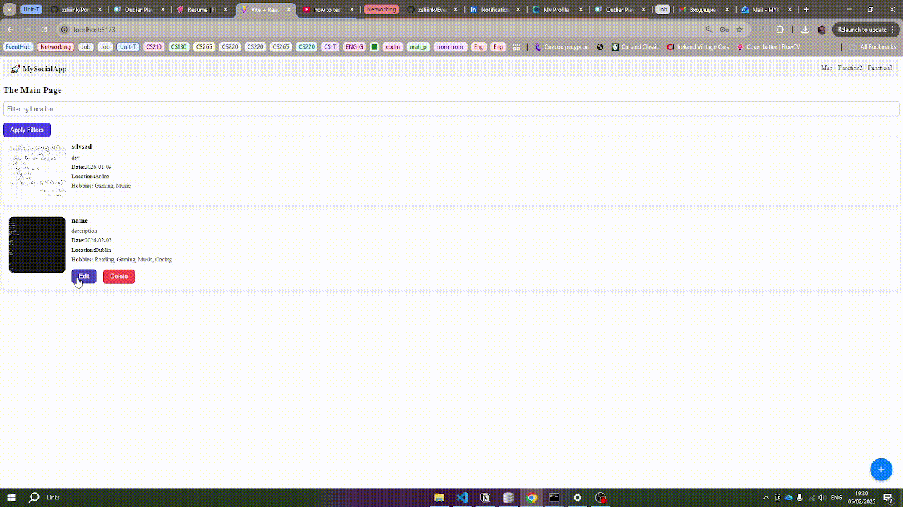

# 🧩 EventHub — Social Event Platform

**EventHub** is a full-stack web application for discovering, creating, updating and filtering social events by hobbies and location.

Users can create their own events, attach images, select hobbies, edit or delete their events, and browse official or community events in real time.

---

## ⚙️ Tech Stack

### 🖥️ Frontend
- **React + TypeScript**
- **Vite** — fast build & hot reload
- **TailwindCSS** — modern styling
- **shadcn/ui + Lucide icons** — UI components
- **Framer Motion** — animations
- **React Router** — client-side routing
- **React Hook Form** — form management
- **JWT** — authentication
- **Fetch API** — backend communication
- **Socket.io client** — real-time updates

### 🧩 Backend
- **Node.js + Express**
- **TypeScript**
- **SQLite3** — lightweight database
- **Multer** — image uploads (events & avatars)
- **Zod** — runtime validation
- **bcrypt** — password hashing
- **jsonwebtoken (JWT)** — authorization
- **Socket.io** — real-time events
- **Jest + Supertest** — integration testing
- **CORS + dotenv** — environment configuration

---

## 🛠 Architectural Refactoring

The project was refactored to follow clean backend architecture and stable API design.

✅ **Modular Routing** — Routes, controllers, services and middlewares are fully separated  
✅ **Strict Type Safety** — No `any` types, shared frontend/backend contracts  
✅ **Zod Validation Layer** — All create/update payloads validated server-side  
✅ **Unified API Contract** — Database fields do not leak to frontend (`name → title`)  
✅ **Mapper Layer** — Dedicated DB → API mappers for consistent responses  
✅ **Async/Await DB Flow** — Predictable database operations  
✅ **Code Quality (DX)** — ESLint & Prettier integration  

---

## 🗃️ Database Structure

| Table | Description |
|--------|--------------|
| `users` | User information |
| `hobbies` | List of all hobbies |
| `events` | Main event data |
| `event_hobbies` | Many-to-many relation between events and hobbies |
| `user_hobbies` | User-hobby relations |
| `friends` | Friend requests and connections |

---

## 🚀 Features

✅ User registration & JWT authentication  
✅ Create events with image upload  
✅ Update events (title, description, date, location, image)  
✅ Delete events with ownership checks  
✅ Attach multiple hobbies per event  
✅ Filter events by location  
✅ Browse official & community events  
✅ Real-time updates via WebSockets  
✅ Adaptive event cards grid  
✅ Component-based UI architecture  

---

## 🧪 Testing

Backend is covered with integration tests to ensure API stability.

- **Tools:** Jest, Supertest  
- **Coverage:**  
  - Auth (Register / Login)  
  - Event create / update / delete  
  - Authorization & ownership checks  
  - Validation errors (400 / 401 / 403)  
- **Isolation:** Separate test database  
- **Execution:** Sequential (`--runInBand`)

Run backend tests:
```bash
cd server && npx jest --runInBand
```

---

## 🧠 Project Architecture

```text
📁 Project Structure
├── 📱 client (Frontend)
│   ├── src
│   │   ├── components     # Reusable UI components
│   │   ├── pages          # App views (Home, Profile, etc.)
│   │   ├── hooks          # Custom hooks (optimistic state, sockets)
│   │   └── App.tsx        # Main routing & layout
│   └── vite.config.ts
│
├── ⚙️ server (Backend)
│   ├── config             # App & environment configuration
│   ├── routes             # HTTP route definitions
│   ├── controllers        # Request handling & orchestration
│   ├── services           # Business logic layer
│   ├── mappers            # DB → API response mapping
│   ├── validation         # Zod schemas for request validation
│   ├── middleware         # Auth, JWT, error handling
│   ├── types              # Server‑only TypeScript types
│   ├── tests              # Integration tests (Jest, Supertest)
│   ├── uploads            # Uploaded images (events, avatars)
│   ├── app.ts             # Express app setup
│   └── db.ts              # SQLite database connection
│
├── 🖼️ screenshots         # Runtime demos (GIF / images)
└── 📄 package.json
```

---

## 🖼️ UI & UX

- Clean and modern interface  
- Event cards with images, location, date, and hobbies  
- Smooth transitions and animations  
- Mobile responsive design  

**Example UI:**
| Home Page | Event Details |
|------------|----------------|
|  |  |

---

## 💾 How to Run Locally

```bash
# 1. Install dependencies
cd server && npm install
cd ../client && npm install

# 2. Run backend and frontend
cd server && npm run dev
cd ../client && npm run dev
App will be available at:
📍 Frontend → http://localhost:5173
📍 Backend → http://localhost:3007
