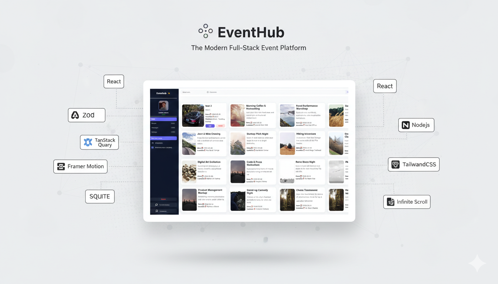
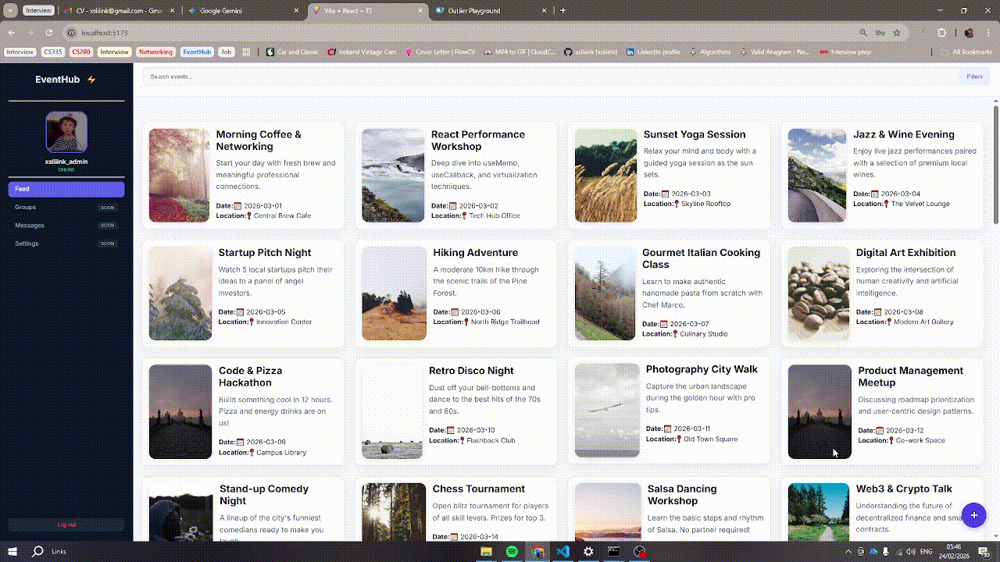
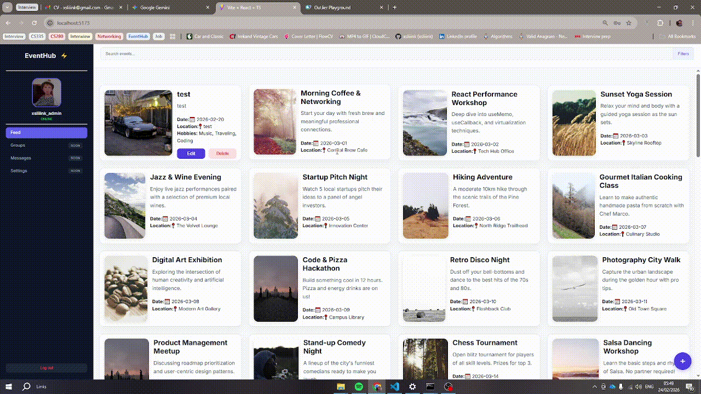

# 🧩 EventHub — Social Event Platform

**EventHub** is a full-stack web application for discovering, creating, updating and filtering social events by hobbies and location.

Users can create their own events, attach images, select hobbies, edit or delete their events, and browse official or community events in real time.

<p align="center">
  
</p>

---

## ⚙️ Tech Stack

### 🖥️ Frontend
- **React + TypeScript**
- **Vite** — fast build & hot reload
- **TanStack Query (React Query)** — server state management & optimistic updates
- **TailwindCSS** — modern styling
- **shadcn/ui + Lucide icons** — UI components
- **Framer Motion** — animations
- **React Router** — client-side routing
- **React Hook Form** — form management
- **JWT** — authentication
- **Fetch API** — backend communication
- **Socket.io client** — real-time updates

### 🧩 Backend
- **Node.js + Express**
- **TypeScript**
- **SQLite3** — lightweight database
- **Multer** — image uploads (events & avatars)
- **Zod** — runtime validation
- **bcrypt** — password hashing
- **jsonwebtoken (JWT)** — authorization
- **Socket.io** — real-time events
- **Jest + Supertest** — integration testing
- **CORS + dotenv** — environment configuration

---

## 🛠 Architectural Refactoring

The project was refactored to follow clean backend architecture and stable API design.

###⚙️ Backend
*✅ **Modular Routing** — Routes, controllers, services and middlewares are fully separated  
*✅ **Strict Type Safety** — No `any` types, shared frontend/backend contracts  
*✅ **Zod Validation Layer** — All create/update payloads validated server-side  
*✅ **Unified API Contract** — Database fields do not leak to frontend (`name → title`)  
*✅ **Mapper Layer** — Dedicated DB → API mappers for consistent responses  
*✅ **Async/Await DB Flow** — Predictable database operations  
*✅ **Code Quality (DX)** — ESLint & Prettier integration  

###💻 Frontend
*✅ **Feature-Based Structure** — Scalable organization by domain features (e.g., features/feed)
*✅ **Optimistic UI Engine** — Instant feedback via TanStack Query with automated rollback
*✅ **Centralized API Layer** — Decoupled service logic for maintainable network calls
*✅ **Global State & Hooks** — Custom hooks for socket connections and state orchestration
*✅ **Strict Linting** — Enforced zero-any policy and unused-vars protection via ESLint
*✅ **Automated Seeding** — Custom script to generate 50+ realistic events for performance testing

---

## 🗃️ Database Structure

| Table | Description |
|--------|--------------|
| `users` | User information |
| `hobbies` | List of all hobbies |
| `events` | Main event data |
| `event_hobbies` | Many-to-many relation between events and hobbies |
| `user_hobbies` | User-hobby relations |
| `friends` | Friend requests and connections |

---

## 🚀 Features

### 🔐 Core & Auth
* ✅ **User Authentication** — Secure registration & login using JWT tokens.
* ✅ **Ownership Protection** — Strict server-side checks for event modification and deletion.

### 📅 Event Management
* ✅ **Optimistic UI** — Create, update, and delete events with instant feedback.
* ✅ **Hobby Ecosystem** — Attach and manage multiple hobbies for every event.
* ✅ **Advanced Media** — Image uploads for events and avatars via Multer.

### 🌊 User Experience (UX)
* ✅ **Infinite Scrolling** — Seamlessly browse through a large feed of events.
* ✅ **Smart Filtering** — Filter by location and multiple hobby categories.
* ✅ **Real-time Sync** — Live updates and notifications via Socket.io.
* ✅ **Adaptive Grid** — Responsive design optimized for desktop and mobile.

### 🛠 Developer Tools
* ✅ **Automated Seeding** — One-command script to populate 50+ realistic events.

---

## 🧪 Testing

Backend is covered with integration tests to ensure API stability.

- **Tools:** Jest, Supertest  
- **Coverage:**  
  - Auth (Register / Login)  
  - Event create / update / delete  
  - Authorization & ownership checks  
  - Validation errors (400 / 401 / 403)  
- **Isolation:** Separate test database  
- **Execution:** Sequential (`--runInBand`)

Run backend tests:
```bash
cd server && npx jest --runInBand
```

---

## 🧠 Project Architecture

```text
📁 Project Structure
├── 📱 client (Frontend)
│   ├── src
│   │   ├── 📁 api          # API definition & Axios services
│   │   ├── 📁 features     # Feature-based modules (Feed, CreateEvent, etc.)
│   │   ├── 📁 hooks        # Global custom hooks (useOptimisticEvents, etc.)
│   │   ├── 📁 layouts      # Page layouts (Navbar, Sidebar wrappers)
|   |   ├── 📁 pages        # Page components (Home, Profile, Auth)
|   |   ├── 📁 shared       # Shared types, constants and contracts
|   |   ├── 📁 styles       # Global SCSS/CSS & Theme configuration
|   |   ├── 📁 utils        # Helper functions and formatters
│   ├── jest.config.ts      # Test environment configuration
|   ├── eslint.config.js    # Strict linting rules (No any, unused-vars)
|   └── tsconfig.json       # TypeScript configuration with path aliases (@/*)
│
├── ⚙️ server (Backend)
│   ├── 📁config             # App & environment configuration
│   ├── 📁routes             # HTTP route definitions
│   ├── 📁controllers        # Request handling & orchestration
│   ├── 📁services           # Business logic layer
│   ├── 📁mappers            # DB → API response mapping
│   ├── 📁validation         # Zod schemas for request validation
│   ├── 📁middleware         # Auth, JWT, error handling
│   ├── 📁types              # Server‑only TypeScript types
│   ├── 📁tests              # Integration tests (Jest, Supertest)
│   ├── 📁uploads            # Uploaded images (events, avatars)
│   ├── app.ts             # Express app setup
│   └── db.ts              # SQLite database connection
│
├── 🖼️ screenshots         # Runtime demos (GIF / images)
└── 📄 package.json
```

---

## 🖼️ UI & UX

* **Optimistic Updates (TanStack Query)**: Actions such as creating, editing, or deleting events are reflected in the UI immediately. In case of server failure, a robust **Rollback mechanism** restores the previous state, ensuring data integrity without blocking the user with loaders.
* **Infinite Scrolling**: Seamless content delivery as the user scrolls, optimized to prevent DOM overstacking and ensure high FPS even with a large number of events.
* **Modern Component Architecture**: Built with `shadcn/ui` and `TailwindCSS` for a consistent, professional look and feel.
* **Fluid Animations**: Powered by `Framer Motion` to provide meaningful visual feedback during state changes and navigation.

**Example UI:**

| Action / Feature | Preview |
|:--- |:---:|
| **Infinite Scroll** <br> Infinite scroll |  |
| **Create/Delete Event** <br> Instant creation and deletion of events. |  |
| **Update Event** <br> Optimistic Event Update. |  |

---

## 💾 How to Run Locally

```bash
# 1. Install dependencies
cd server && npm install
cd ../client && npm install

# 2.This will generate 50+ events(Required for Infinite Scroll)
cd ../server && npx ts-node seed.ts


# 3. Run backend and frontend
cd server && npm run dev
cd ../client && npm run dev
App will be available at:
📍 Frontend → http://localhost:5173
📍 Backend → http://localhost:3007
